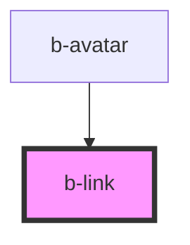

# b-link

<!-- Auto Generated Below -->

## Properties

| Property            | Attribute    | Description | Type                                         | Default     |
| ------------------- | ------------ | ----------- | -------------------------------------------- | ----------- |
| `href` _(required)_ | `href`       |             | `string`                                     | `undefined` |
| `target`            | `target`     |             | `"_blank" \| "_parent" \| "_self" \| "_top"` | `'_self'`   |
| `upperCase`         | `upper-case` |             | `boolean`                                    | `undefined` |

## Dependencies

### Used by

 - [b-avatar](../b-avatar)

### Graph

----------------------------------------------

*Built with [StencilJS](https://stenciljs.com/)*
